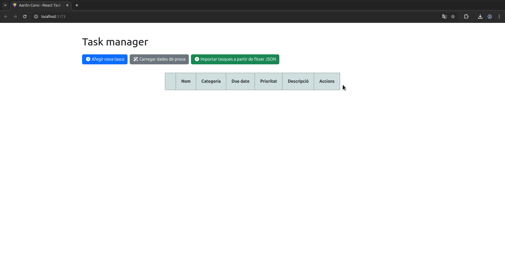
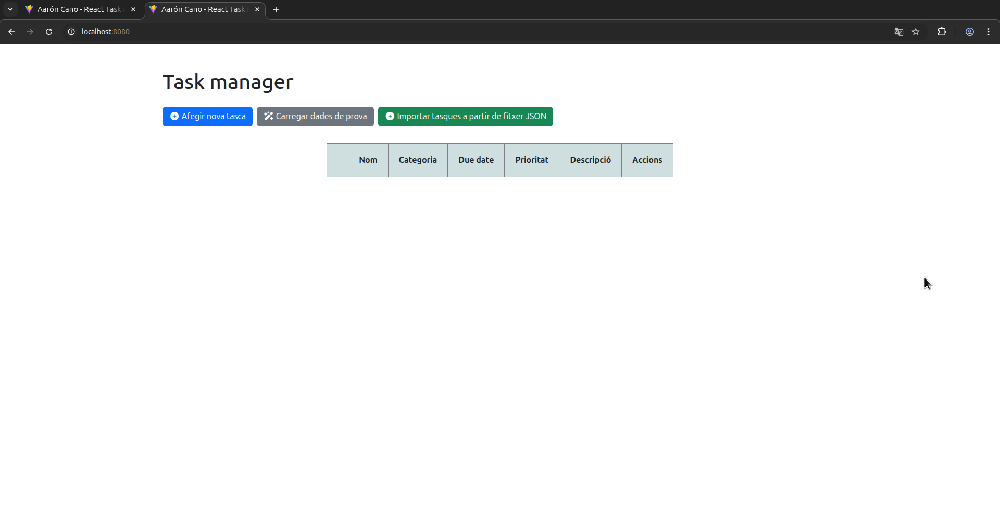
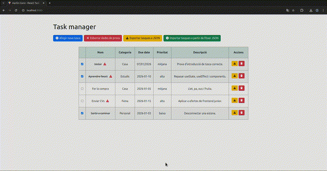

# ⚛️ React Task Manager

## 📑 Índex

- [🎯 Objectiu del projecte](#-objectiu-del-projecte)
- [🛠️ Tech stack (Tecnologies utilitzades)](#️-tech-stack-tecnologies-utilitzades)
- [📁 Estructura del projecte](#-estructura-del-projecte)
- [👀 Requisits previs](#-requisits-previs)
- [⚙️ Instal·lació (local)](#️-installació-local)
- [🐳 Instal·lació (Docker)](#-installació-docker)
- [⏩ Funcionalitats](#-funcionalitats)
  - [➕ Afegir tasques](#-afegir-tasques)
  - [📤 Exportar tasques](#-exportar-tasques)
  - [📥 Importar tasques](#-importar-tasques)
  - [✔️ Marcar i desmarcar tasca](#️-marcar-i-desmarcar-tasca)
  - [🚮 Eliminar tasca](#-eliminar-tasca)
- [📃 Changelog (Bitàcola)](#-changelog-bitácola)

---

## 🎯 Objectiu del projecte

Aquest projecte consisteix en crear un gestor de tasques amb React que permeti realitzar les següents operacions:

- **Crear tasques**
- **Emmagatzemar les tasques al navegador web (utilitzant localStorage)**
- **Carregar dades de prova**
- **Llistar totes les tasques creades**
- **Marcar i desmarcar tasques**
- **Eliminar les tasques**
- **Exportar i importar tasques a JSON**

---

## 🛠️ Tech stack (Tecnologies utilitzades)

- **Frontend**: React + Vite
- **Styles**: Bootstrap + CSS
- **Icones**: [Font Awesome](https://fontawesome.com/)
- **Gestió de formularis**: React Hook Form
- **Validacions**: Zod
- **Contenidor**: Docker
- **Imatge Docker**: [Node:22 Alpine](https://hub.docker.com/layers/library/node/22-alpine/images/sha256-3a4802e64ab5181c7870d6ddd8c824c2efc42873baae37d1971451668659483b)
- **Servidor web per a Docker**: Nginx

---

## 📁 Estructura del projecte

```
/
├── public/
├── readme_src/
├── src/
│   ├── assets/
│   ├── components/
│   │   ├── Button.jsx
│   │   ├── Card.jsx
│   │   ├── Checkbox.jsx
│   │   ├── Form.jsx
│   │   ├── Input.jsx
│   │   ├── Modal.jsx
│   │   ├── RadioButton.jsx
│   │   ├── RadioGroup.jsx
│   │   ├── Select.jsx
│   │   ├── Tasklist.jsx
│   │   └── Textarea.jsx
│   ├── constants/
│   │   └── index.js
│   ├── schemas/
│   │   └── task.js
│   ├── seeders/
│   │   └── task_seed.js
│   ├── styles/
│   │   └── App.css
│   ├── App.jsx
│   └── main.jsx
├── .dockerignore
├── .gitignore
├── Dockerfile
├── eslint.config.js
├── index.html
├── nginx.conf
├── package-lock.json
├── package.json
├── README.md
├── T2_Pt1_GestorTasques_Enunciat.md
└── vite.config.js
```

**Nota**: En el projecte del repositori falten directoris com per exemple `node_modules`, essencials per al funcionament de l'aplicació, més endavant seguint els passos de la instal·lació es poden restaurar.

---

## 👀 Requisits previs

- **[Node JS 22.21.1](https://nodejs.org/en/download)**
- **[Git](https://git-scm.com/install/)**
- **[Docker Engine (si es vol utilitzar des de un contenidor)](https://docs.docker.com/engine/install/)**

**Nota**: És possible que si treballes des de una distribució Linux ja tinguis Git instal·lat, pots comprovar-ho amb la següent comanda:

```bash
git --version
```

La sortida hauria de ser similar a la següent:

```bash
git version 2.43.0
```

---

## ⚙️ Instal·lació (local)

Després d'haver instal·lat NodeJS i Git obrim un terminal (o si estàs des de Windows l'aplicació **Git Bash**) i clonem el repositori:

```bash
git clone https://github.com/aaroncano2006/react_task_manager.git
```
O també amb la teva clau SSH:

```bash
git clone git@github.com:aaroncano2006/react_task_manager.git
```

En situem dins del directori i reconstruïm els mòduls de Node, necessaris per al funcionament de l'aplicació:

```bash
npm install
npm run build
```

Finalment accedirem de forma local a l'aplicació:

```bash
npm run dev
```

Accedim a la URL que ens doni la sortida i ja estarem dins de l'aplicació:



---

## 🐳 Instal·lació (Docker)

Després de clonar el repositori, si volem executar l'aplicació des de un contenidor Docker el primer que farem serà crear la imatge a partir del `Dockerfile` pujat al repositori:

```bash
docker build -t aaroncano_react_taskmanager .
```

Posem en marxa el contenidor amb la següent comanda:

```bash
docker run -dp 8080:80 aaroncano_react_taskmanager
```

Això exposarà el port 80 del contenidor en el port 8080 de la nostra màquina, per tant accedirem a l'aplicació des de `localhost:8080`:



---

## ⏩ Funcionalitats

### ➕ Afegir tasques

Pressionant el botó blau amb el text `Afegir nova tasca` es desplegarà un formulari amb els següents camps a omplir i amb requisits que han d'omplir:

- Nom de la tasca (Mínim 5 caràcters)
- Categoria (Personal, Casa, Feina, Estudis) (Només una d'aquestes categories predefinides)
- Data límit (Format DD/MM/YYYY que ja es converteix a l'enviar el formulari i com a mínim ha de ser el dia següent de l'actual)
- Prioritat (Alta, Mitjana, Baixa) (Només una d'aquestes prioritats predefinides)
- Marcar com a important (opcional) (En el llistat es marcarà amb una icona semblant a aquesta )
- Descripció (Màxim 300 caràcters) (opcional)


Si enviem dades erronees o ens deixem dades obligatòries serem informats amb missatges d'error dinàmics.


Si totes les dades són correctes, s'afegirà al llistat:


Per testejar el funcionament de l'aplicació i com funcionen i es llisten les tasques tenim l'opció de **Carregar dades de prova**, que mostra exemples de com es veurien tasques reals dins d'aquest gestor de tasques:


Les tasques introduïdes es desen al navegador web utilitzat, per tant persistiran encara que es tanqui la finestra o tot el navegador.

### 📤 Exportar tasques

Per exportar les teves tasques introduïdes i desades al navegador simplement pressionem el botó groc amb el text **Exportar tasques a JSON**, visible sempre que hi hagi al menys una tasca creada.

Cliquem al botó i s'ens descarregarà un fitxer JSON amb totes les tasques introduïdes que podrem importar en qualsevol moment:


També pots exportar tasques individualment amb el botó groc amb l'icona de descàrrega en la columna d'accions.

### 📥 Importar tasques

Per importar el fitxer JSON (per exemple en un altre navegador) ens dirigim al botó verd amb el text **Importar tasques a partir de fitxer JSON**, es deplegarà un formulari simple on podrem adjuntar el fitxer JSON i totes les tasques s'afegiran al llistat:


**NOTA**: És important que les tasques dins del fitxer JSON segueixin el següent format en cas de que es vulguin importar tasques creades fora de l'aplicació, del contrari, el fitxer no serà acceptat:

```json
{
  "taskName": "tester",
  "taskCategory": "Casa",
  "taskDueDate": "07/01/2026",
  "taskPriority": "mitjana",
  "taskImportant": true,
  "taskDescription": "Prova d'introducció de tasca correcte.",
  "taskId": 1767730652920,
  "completed": false
}
```

També és vàlid si els mateixos camps estàn en diferent ordre i es recomana no utilitzar com a ID els números del 1 al 4 ja que són les tasques de prova.

### ✔️ Marcar i desmarcar tasca

Per marcar una tasca com a complerta o desmarcar-la simplement hem de marcar la checkbox corresponent a la tasca que volem indicar si ha estat complerta o no, l'estat de la tasca canviarà en funció del seu estat previ:


### 🚮 Eliminar tasca

Per eliminar una tasca del llistat simplement hem de clicar al botó amb icono de paperera corresponent a la tasca i ens mostrarà un modal advertint-nos de que aquesta acció és irreversible, si acceptem, la tasca s'haurà eliminat amb éxit.



---

## 📃 Changelog (Bitàcola)

`11/12/2025:` **Commit inicial**:

- Estructura inicial del projecte amb components, schemas i estils básics.

- Maquetació inicial de l'aplicació, només pàgina principal amb títol, botó per crear nova tasca (no funcional) i taula buida amb classes Bootstrap i estils inicials.

`15/12/2025`: **Nous components**:

- S'han afegit els components **Link, Select i Textarea**

- Contingut placeholder al formulari (será modificat durant els següents canvis)

- S'ha creat l'array **faker** per provar la visualització del llistat amb dades de prova. (El nom dels camps no correspon amb els del producte final).

- Estils i classes de la taula de la pàgina principal modificats (Afegida classe p-3 als td i text-align: center a les files).

- **Zod schema** per a les tasques.

** A partir dels següents dies es realitzaran diferents branques pel desenvolupament, d'aquesta forma podrem controlar millor quins canvis es realitzen en un dia determinat i tindrem menys risc de trencar el funcionament de la branca **`main`**. Una vegada acabi el dia i es comprovi que els canvis funcionen, realitzarem **`Pull Request`** i tindrem la branca **`main`** actualitzada **

`16/12/2025 (dev16122025)`:

- Eliminat component **Link**.

- S'ha creat un fitxer anomenat **convert.html**, aquest fitxer només serveix per escriure els components en HTML i després traduïrlos a JSX, com que no té un impacte més enllà d'escriure només HTML, no serà rastrejat. S'ha afegit a **.gitignore**.

- S'ha afegit `taskPriority` al **Zod Schema `task.js`**. Aquest error era crític ja que si no existeix a zod quan es crei una nova tasca no tindrà en compte la prioritat i hauran errors en les dades.

- Afegit component **RadioGroup**.

- **Canvis en l'estructura del projecte**: Per simplificar l'aplicació, el formulari estarà a la mateixa pàgina que el llistat.

- Afegit component **Card**.

- Modificat l’ús d’enum al Zod Schema per adaptar-lo a la sintaxi correcta de Zod.

- Integració de react-hook-form amb FormProvider i useFormContext per millorar l’arquitectura del formulari.

- Refactorització del component Input perquè sigui reutilitzable i estigui connectat al context del formulari i sigui compatible amb la validació per Zod.

`17/12/2025 (dev17122025)`:

- Eliminat CDN de Font Awesome a `index.html`. S'ha instal·lat via `npm`.

- Component **`Select.jsx`** modificat per compatibilitzar-ho amb el formulari.

- Constant `categories` afegida i **`taskCategory`** implementada al formulari amb les seves validacions de Zod Schema.

- Ajustos de classes Bootstrap i CSS.

- Camp **És important?** eliminat del llistat. Serà substituit amb una icona Font Awesome al costat del nom.

- **`taskDueDate`** implementada al formulari amb les seves validacions.

- Zod Schema `task.js` corregit per a validar correctament **`taskDueDate`**

- Atribut `defaultValue` afegit al component **`Input.jsx`** per fer-ho compatible amb el funcionament del component **`RadioGroup.jsx`**.

- Component **`RadioButton.jsx`** creat. Es manté la propietat `defaultValue` a **`Input.jsx`** per compatibilitat en cas de ser necessaria per a futurs canvis en l'apliació.

- Constants `prioritatsBase` (identificador únic i nom de la prioritat) i `prioritats` (prioritatBase amb les seves propietats + identificadors per a HTML i valors del RadioButton per coincidir amb el Zod Schema) creades.

- Atribut `key` afegit als componentes **`RadioButton`** de **`App.jsx`** per evitar problemes de duplicitat i errors en consola.

`18/12/2025 (dev18122025)`:

- S'ha modificat la maquetació del component **`RadioButton.jsx`**

- Component **`Checkbox.jsx`** creat.

- Afegit `type="checkbox"` a **`Checkbox.jsx`** i camp **`taskImportant`** afeigt al formulari.

- Component **`Textarea.jsx`** modificat per ser compatible amb el formulari.

- Afegit camp **`taskDescription`** al formulari.

- S'ha corregit una propietat erronea al component **`Select.jsx`** que no permetia agafar les classes Bootstrap.

- S'han afegit marges amb Bootsrap a les labels de **`RadioButton.jsx`** i **`Checkbox.jsx`**.

- S'ha corregit el component **`Checkbox.jsx`** ja que no tenia el codi per estar dins del context del formulari.

- S'ha modificat la maquetació de les columnes del formulari amb la classe Bootstrap `col-10`.

- Validacions corregides i funcionals amb missatges personalitzats.

`20/12/2025 (dev20122025):`

- Eliminat array `faker` de **`App.jsx`** per implementar la creació de tasques amb peristència.

- Eliminat `<tr>` de la taula a **`App.jsx`**.

- Afegit atribut `type` a **`Button.jsx`**, d'aquesta forma podrem crear botons normals i submit per al formulari.

`21/12/2025 (dev21122025):`

- Scroll per al llistat de tasques eliminat.

- Component **`Input.jsx`** refactoritzat per soportar `type="hidden"` i afegir al formulari els camps ocults **`taskId`** i **`completed`**.

- Persistència a `localStorage` al fer submit al formulari.

- Afegits camps ocults del formulari al Zod Schema per a persistir correctament l'objecte.

- Coerce afegit als valors booleans del Zod Schema per evitar que s'enviin strings.

- Persistència a `localStorage` corregida amb `JSON.stringify`.

`23/12/2025 (dev23122025):`

- Constants globals de **`App.jsx`** refactoritzades.

- Component **`Tasklist.jsx`** creat i tasques de `localStorage` renderitzades al llistat.

- Corregida classe Bootstrap per al botó d'acció d'eliminar.

`24/12/2025 (dev24122025):`

- Afegits atributs `target` i `action` a **`Button.jsx`** per poder manipular funcions que afecten a elements del DOM.

- Eliminació de tasques implementada. S'ha afegit l'atribut `data-set` als `<tr>` de **`Tasklist.jsx`** i la funció `deleteTask`.
  Es passa com a valor de `target` al botó d'eliminar `taskId` i com a `action` `deleteTask`, automàticament l'event de clicar el botó serà la funció apuntant a la fila que correspon amb la id de la tasca.

- Per defecte `completed` no s'enviarà amb `defaultValue` per evitar que el seu valor sigui `true`.

- Ara la checkbox del llistat es renderitzarà marcada en funció de si `completed` es `true` o `false`.

- Ara **`taskImportant`** s'enviarà correctament al fer submit, per tant, ja es pot marcar correctament com a important qualsevol tasca, es renderitzarà una icona al costat del nom indicant que és una tasca important.

`30/12/2025 (dev30122025):`

- S'ha refactoritzat tota l'aplicació per utilitzar `useState` en comptes de tocar el DOM directament per utilitzar bones pràctiques de React, si canvia l'estat el DOM també canvia. Amb això, s'han mogut les funcions dels components **`Form.jsx`** i **`Tasklist.jsx`** a **`App.jsx`** i ara es passen com a paràmetre en els seus respectius components als atributs `submitHandler`.

- **`Tasklist.jxs`** ja no rep `localStorage` com a `content`, ara rep l'array `tasks`, que funciona amb `useState` i permet recarregar el contingut de la taula dinàmicament sense tocar el DOM manualment.

- S'han eliminat els input hidden del formulari, ara la id i `completed` iniciat a `false` s'afegeixen a la funció `addTask` juntament amb la resta de dades que s'envien del formulari. Aquest camps han sigut eliminats també del Zod Schema per mantenir el funcionament del formulari i no validar aquests camps.

- S'ha eliminat la constant `MAX_KEY` ja que aquesta depenia de la longitud de `localStorage` i podien haver-hi problemes de keys duplicades quan s'eliminaven elements. Ara la id es crea a partir del timestamp en el moment de fer submit.

- Ja es poden marcar i desmarcar tasques com a completades.

`02/01/2026 (dev02012026):`

- S'ha afegit un collapse de Bootstrap al component **`Card.jsx`** per poder visualitzar directament les tasques i només mostrar el formulari quan realment es necessiti afegir una tasca.

`04/01/2026 (dev04012026):`

- S'ha afegit el seeder **`task_seed.js`** per poder carregar dades de prova a l'apliació amb la nova funció `loadSeeder`.

- Seeder modificat amb IDs fixes sense `Date.now()` (1, 2, 3, 4) per poder identificar quines tasques venen del seeder i quines del formulari.

- Refactor de la persistència amb `localStorage`, ara les tasques es desen a un array amb la key `tasks` dins de `localStorage`. Aquest canvi és una bona pràctica ja que en cas de necessitar persistir més objectes a part de tasques no es barrejarien al llistat ni a l'emmagatzemament i podrem identificar millor on es troba cada cosa.

- Ja es poden eliminar les tasques generades des del seeder. A més s'ha afegit un renderitzat opcional que mostrarà el botó de carregar o d'esborrar en funció de si el seeder s'ha executat o no.

- Renderitzat condicional al llistat. Si no hi ha descripció s'escriurà "-" i si la tasca s'ha completat s'aplicarà un fons gris clar.

- Classes de bootstrap modificades als botons de **`App.jsx`** per fer el disseny més responsive.

- Taula amb llistat de tasques compatible amb disseny responsive.

`05/01/2025 (dev05012026):`

- S'ha eliminat el paràmetre `target` de **`Button.jsx`** i ara `children` dins del mateix component pot ser null.

- Constants globals relocalitzades a `src/constants/index.js`.

- Nou component **`Modal.jsx`** i confirmació d'eliminació mitjançant modal implementada.

- S'ha afegit la possibilitat d'exportar tasques en format JSON.

- S'ha afegit la importació de tasques mitjançant un fixer JSON.

- Validació de fitxer JSON segons el format de tasques utilitzat a l'aplicació per evitar l'importació de dades que no coincideixen amb el model a seguir del que s'emmagatzema a `localStorage` i que trenquen el bon funcionament de l'aplicació.

- Renderitzat condicional per al botó d'exportar tasques. Només serà visible quan hi hagin tasques emmagatzemades a `localStorage.`

`06/01/2026 (main)`:

- Dockerfile i configuració de Nginx per servir l'aplicació des de un contenidor.

- S'ha afegit una label indicant on es troba la prioritat al formulari.

- Documentació de l'aplicació finalitzada a `README.md`

---

### 👤 Autor
**Aarón Cano Fernández (rxnwashere)**  
💻 2n DAW \
📚 Institut Carles Vallbona
